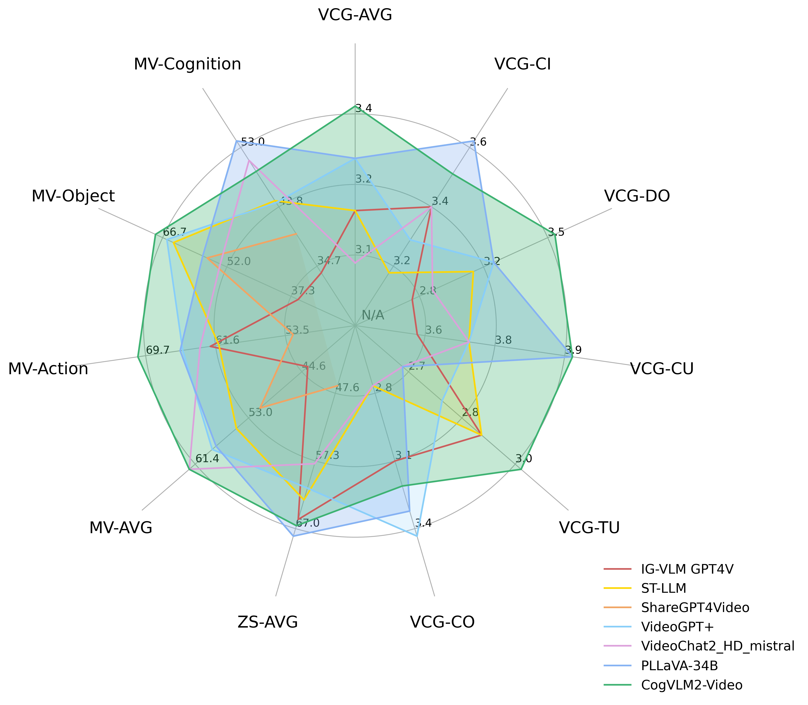

# CogVLM2

[中文版README](./README_zh.md)

<div align="center">
 
</div>

<p align="center">
    👋 Join our <a href="resources/WECHAT.md" target="_blank">Wechat</a> · 💡Try it <a href="http://36.103.203.44:7861/" target="_blank">Online</a>
</p>
<p align="center">
📍Experience the larger-scale CogVLM model on the <a href="https://open.bigmodel.cn/?utm_campaign=open&_channel_track_key=OWTVNma9">ZhipuAI Open Platform</a>.
</p>

## Recent updates

- 🔥 **News**: ``2024/7/8``: We released the video understanding version of the CogVLM2 model, the CogVLM2-Video model.
  By extracting keyframes, it can interpret continuous images. The model can support videos of up to 1 minute. See more in our [blog](https://cogvlm2-video.github.io/).
- 🔥 **News**: ``2024/6/8``:We release [CogVLM2 TGI Weight](https://huggingface.co/THUDM/cogvlm2-llama3-chat-19B-tgi),
  which is a model can be inferred in [TGI](https://huggingface.co/docs/text-generation-inference/en/index). See
  Inference Code in [here](https://github.com/leizhao1234/cogvlm2)
- 🔥 **News**: ``2024/6/5``:We release [GLM-4V-9B](https://huggingface.co/THUDM/glm-4v-9b), which use the same data and
  training recipes as CogVLM2 but with GLM-9B as the language backbone. We removed visual experts to reduce the model
  size to 13B. More details at [GLM-4 repo](https://github.com/THUDM/GLM-4/).
- 🔥 **News**: ``2024/5/24``: We have released
  the [Int4 version model](https://huggingface.co/THUDM/cogvlm2-llama3-chat-19B-int4), which requires only 16GB of video
  memory for inference. You can also run on-the-fly int4 version by passing `--quant 4`.
- 🔥 **News**: ``2024/5/20``: We released the next generation model CogVLM2, which is based on llama3-8b and is
  equivalent (or better) to GPT-4V in most cases ! Welcome to download!

## Model introduction

We launch a new generation of **CogVLM2** series of models and open source two models based
on [Meta-Llama-3-8B-Instruct](https://huggingface.co/meta-llama/Meta-Llama-3-8B-Instruct). Compared with the previous
generation of CogVLM open source models, the CogVLM2 series of open source models have the following improvements:

1. Significant improvements in many benchmarks such as `TextVQA`, `DocVQA`.
2. Support **8K** content length.
3. Support image resolution up to **1344 * 1344**.
4. Provide an open source model version that supports both **Chinese and English**.

You can see the details of the **CogVLM2** family of open source models in the table below:

| Model Name       | cogvlm2-llama3-chat-19B                                                                                                                                                                                                                                  | cogvlm2-llama3-chinese-chat-19B                                                                                                                                                                                                                                          | cogvlm2-video-llama3-chat                                                                                                                                 | cogvlm2-video-llama3-base                                                                                                                                 |  
|------------------|----------------------------------------------------------------------------------------------------------------------------------------------------------------------------------------------------------------------------------------------------------|--------------------------------------------------------------------------------------------------------------------------------------------------------------------------------------------------------------------------------------------------------------------------|-----------------------------------------------------------------------------------------------------------------------------------------------------------|-----------------------------------------------------------------------------------------------------------------------------------------------------------|
| Base Model       | Meta-Llama-3-8B-Instruct                                                                                                                                                                                                                                 | Meta-Llama-3-8B-Instruct                                                                                                                                                                                                                                                 | Meta-Llama-3-8B-Instruct                                                                                                                                  | Meta-Llama-3-8B-Instruct                                                                                                                                  |
| Language         | English                                                                                                                                                                                                                                                  | Chinese, English                                                                                                                                                                                                                                                         | English                                                                                                                                                   | English                                                                                                                                                   |
| Task             | Image Understanding, Multi-turn Dialogue Model                                                                                                                                                                                                           | Image Understanding, Multi-turn Dialogue Model                                                                                                                                                                                                                           | Video Understanding, Single-turn Dialogue Model                                                                                                           | Video Understanding, Base Model, No Dialogue                                                                                                              |
| Model Link       | [🤗 Huggingface](https://huggingface.co/THUDM/cogvlm2-llama3-chat-19B)  [🤖 ModelScope](https://modelscope.cn/models/ZhipuAI/cogvlm2-llama3-chat-19B/)  [💫 Wise Model](https://wisemodel.cn/models/ZhipuAI/cogvlm2-llama3-chat-19B/)                    | [🤗 Huggingface](https://huggingface.co/THUDM/cogvlm2-llama3-chinese-chat-19B) [🤖 ModelScope](https://modelscope.cn/models/ZhipuAI/cogvlm2-llama3-chinese-chat-19B/)  [💫 Wise Model](https://wisemodel.cn/models/ZhipuAI/cogvlm2-llama3-chinese-chat-19B)              | [🤗 Huggingface](https://huggingface.co/THUDM/cogvlm2-video-llama3-chat)  [🤖 ModelScope](https://modelscope.cn/models/ZhipuAI/cogvlm2-video-llama3-chat) | [🤗 Huggingface](https://huggingface.co/THUDM/cogvlm2-video-llama3-base)  [🤖 ModelScope](https://modelscope.cn/models/ZhipuAI/cogvlm2-video-llama3-base) |
| Experience Link  | [📙 Official Page](http://36.103.203.44:7861/)                                                                                                                                                                                                           | [📙 Official Page](http://36.103.203.44:7861/) [🤖 ModelScope](https://modelscope.cn/studios/ZhipuAI/Cogvlm2-llama3-chinese-chat-Demo/summary)                                                                                                                           | /                                                                                                                                                         | /                                                                                                                                                         |
| Int4 Model       | [🤗 Huggingface](https://huggingface.co/THUDM/cogvlm2-llama3-chat-19B-int4)  [🤖 ModelScope](https://modelscope.cn/models/ZhipuAI/cogvlm2-llama3-chat-19B-int4)       [💫 Wise Model](https://wisemodel.cn/models/ZhipuAI/cogvlm2-llama3-chat-19B-int4/) | [🤗 Huggingface](https://huggingface.co/THUDM/cogvlm2-llama3-chinese-chat-19B-int4) [🤖 ModelScope](https://modelscope.cn/models/ZhipuAI/cogvlm2-llama3-chinese-chat-19B-int4) [💫 Wise Model](https://wisemodel.cn/models/ZhipuAI/cogvlm2-llama3-chinse-chat-19B-int4/) | /                                                                                                                                                         | /                                                                                                                                                         |
| Text Length      | 8K                                                                                                                                                                                                                                                       | 8K                                                                                                                                                                                                                                                                       | 2K                                                                                                                                                        | 2K                                                                                                                                                        |
| Image Resolution | 1344 * 1344                                                                                                                                                                                                                                              | 1344 * 1344                                                                                                                                                                                                                                                              | 224 * 224 (Video, take the first 24 frames)                                                                                                               | 224 * 224 (Video, take the average 24 frames)                                                                                                             |

## Benchmark

### Image Understand

Our open source models have achieved good results in many lists compared to the previous generation of CogVLM open
source models. Its excellent performance can compete with some non-open source models, as shown in the table below:

| Model                      | Open Source | LLM Size | TextVQA  | DocVQA   | ChartQA  | OCRbench | MMMU     | MMVet    | MMBench  |
|----------------------------|-------------|----------|----------|----------|----------|----------|----------|----------|----------|
| CogVLM1.1                  | ✅           | 7B       | 69.7     | -        | 68.3     | 590      | 37.3     | 52.0     | 65.8     |
| LLaVA-1.5                  | ✅           | 13B      | 61.3     | -        | -        | 337      | 37.0     | 35.4     | 67.7     |
| Mini-Gemini                | ✅           | 34B      | 74.1     | -        | -        | -        | 48.0     | 59.3     | 80.6     |
| LLaVA-NeXT-LLaMA3          | ✅           | 8B       | -        | 78.2     | 69.5     | -        | 41.7     | -        | 72.1     |
| LLaVA-NeXT-110B            | ✅           | 110B     | -        | 85.7     | 79.7     | -        | 49.1     | -        | 80.5     |
| InternVL-1.5               | ✅           | 20B      | 80.6     | 90.9     | **83.8** | 720      | 46.8     | 55.4     | **82.3** |
| QwenVL-Plus                | ❌           | -        | 78.9     | 91.4     | 78.1     | 726      | 51.4     | 55.7     | 67.0     |
| Claude3-Opus               | ❌           | -        | -        | 89.3     | 80.8     | 694      | **59.4** | 51.7     | 63.3     |
| Gemini Pro 1.5             | ❌           | -        | 73.5     | 86.5     | 81.3     | -        | 58.5     | -        | -        |
| GPT-4V                     | ❌           | -        | 78.0     | 88.4     | 78.5     | 656      | 56.8     | **67.7** | 75.0     |
| **CogVLM2-LLaMA3**         | ✅           | 8B       | 84.2     | **92.3** | 81.0     | 756      | 44.3     | 60.4     | 80.5     |
| **CogVLM2-LLaMA3-Chinese** | ✅           | 8B       | **85.0** | 88.4     | 74.7     | **780**  | 42.8     | 60.5     | 78.9     |

All reviews were obtained without using any external OCR tools ("pixel only").

### Video Understand

CogVLM2-Video achieves state-of-the-art performance on multiple video question answering tasks. The following diagram
shows the performance of CogVLM2-Video on the [MVBench](https://github.com/OpenGVLab/Ask-Anything), [VideoChatGPT-Bench](https://github.com/mbzuai-oryx/Video-ChatGPT)
and Zero-shot VideoQA datasets (MSVD-QA, MSRVTT-QA, ActivityNet-QA). Where VCG-* refers to the VideoChatGPTBench, ZS-*
refers to Zero-Shot VideoQA datasets and MV-* refers to main categories in the MVBench.



### Detailed performance

Performance on VideoChatGPT-Bench and Zero-shot VideoQA dataset:

| Models                | VCG-AVG  | VCG-CI   | VCG-DO   | VCG-CU   | VCG-TU   | VCG-CO   | ZS-AVG    |
|-----------------------|----------|----------|----------|----------|----------|----------|-----------|
| IG-VLM GPT4V          | 3.17     | 3.40     | 2.80     | 3.61     | 2.89     | 3.13     | 65.70     |
| ST-LLM                | 3.15     | 3.23     | 3.05     | 3.74     | 2.93     | 2.81     | 62.90     |
| ShareGPT4Video        | N/A      | N/A      | N/A      | N/A      | N/A      | N/A      | 46.50     |
| VideoGPT+             | 3.28     | 3.27     | 3.18     | 3.74     | 2.83     | **3.39** | 61.20     |
| VideoChat2_HD_mistral | 3.10     | 3.40     | 2.91     | 3.72     | 2.65     | 2.84     | 57.70     |
| PLLaVA-34B            | 3.32     | **3.60** | 3.20     | **3.90** | 2.67     | 3.25     | **68.10** | 
| CogVLM2-Video         | **3.41** | 3.49     | **3.46** | 3.87     | **2.98** | 3.23     | 66.60     |

Performance on MVBench dataset:

| Models                | AVG      | AA       | AC       | AL       | AP       | AS       | CO       | CI       | EN       | ER       | FA       | FP       | MA       | MC       | MD       | OE       | OI       | OS       | ST       | SC       | UA       |
|-----------------------|----------|----------|----------|----------|----------|----------|----------|----------|----------|----------|----------|----------|----------|----------|----------|----------|----------|----------|----------|----------|----------|
| IG-VLM GPT4V          | 43.7     | 72.0     | 39.0     | 40.5     | 63.5     | 55.5     | 52.0     | 11.0     | 31.0     | 59.0     | 46.5     | 47.5     | 22.5     | 12.0     | 12.0     | 18.5     | 59.0     | 29.5     | 83.5     | 45.0     | 73.5     |
| ST-LLM                | 54.9     | 84.0     | 36.5     | 31.0     | 53.5     | 66.0     | 46.5     | 58.5     | 34.5     | 41.5     | 44.0     | 44.5     | 78.5     | 56.5     | 42.5     | 80.5     | 73.5     | 38.5     | 86.5     | 43.0     | 58.5     |
| ShareGPT4Video        | 51.2     | 79.5     | 35.5     | 41.5     | 39.5     | 49.5     | 46.5     | 51.5     | 28.5     | 39.0     | 40.0     | 25.5     | 75.0     | 62.5     | 50.5     | 82.5     | 54.5     | 32.5     | 84.5     | 51.0     | 54.5     |
| VideoGPT+             | 58.7     | 83.0     | 39.5     | 34.0     | 60.0     | 69.0     | 50.0     | 60.0     | 29.5     | 44.0     | 48.5     | 53.0     | 90.5     | 71.0     | 44.0     | 85.5     | 75.5     | 36.0     | 89.5     | 45.0     | 66.5     |
| VideoChat2_HD_mistral | **62.3** | 79.5     | **60.0** | **87.5** | 50.0     | 68.5     | **93.5** | 71.5     | 36.5     | 45.0     | 49.5     | **87.0** | 40.0     | **76.0** | **92.0** | 53.0     | 62.0     | **45.5** | 36.0     | 44.0     | 69.5     |
| PLLaVA-34B            | 58.1     | 82.0     | 40.5     | 49.5     | 53.0     | 67.5     | 66.5     | 59.0     | **39.5** | **63.5** | 47.0     | 50.0     | 70.0     | 43.0     | 37.5     | 68.5     | 67.5     | 36.5     | 91.0     | 51.5     | **79.0** |
| CogVLM2-Video         | **62.3** | **85.5** | 41.5     | 31.5     | **65.5** | **79.5** | 58.5     | **77.0** | 28.5     | 42.5     | **54.0** | 57.0     | **91.5** | 73.0     | 48.0     | **91.0** | **78.0** | 36.0     | **91.5** | **47.0** | 68.5     |

## Project structure

This open source repos will help developers to quickly get started with the basic calling methods of the CogVLM2 open
source model, fine-tuning examples, OpenAI API format calling examples, etc. The specific project structure is as
follows, you can click to enter the corresponding tutorial link:

## [basic_demo](basic_demo/README.md) folder includes:

+ **CLI** demo, inference CogVLM2 model.
+ **CLI** demo, inference CogVLM2 model using multiple GPUs.
+ **Web** demo, provided by chainlit.
+ **API** server, in OpenAI format.
+ **Int4** can be easily enabled with `--quant 4`, memory usage is 16GB.

## [finetune_demo](finetune_demo/README.md) folder includes:

+ [**peft**](https://github.com/huggingface/peft) framework's efficient fine-tuning example.

## [video_demo](video_demo/README.md) folder includes:

+ **CLI** demo, inference CogVLM2-Video model.
+ **Int4** can be easily enabled with `--quant 4`, with 16GB memory usage.

## Useful Links

In addition to the official inference code, you can also refer to the following community-provided inference solutions:

+ [**xinference**](https://github.com/xorbitsai/inference/pull/1551)

## License

This model is released under the CogVLM2 [CogVLM2 LICENSE](MODEL_LICENSE). For models built with Meta Llama 3, please
also adhere to the [LLAMA3_LICENSE](https://llama.meta.com/llama3/license/).

## Citation

If you find our work helpful, please consider citing the following papers

```
@misc{wang2023cogvlm,
      title={CogVLM: Visual Expert for Pretrained Language Models}, 
      author={Weihan Wang and Qingsong Lv and Wenmeng Yu and Wenyi Hong and Ji Qi and Yan Wang and Junhui Ji and Zhuoyi Yang and Lei Zhao and Xixuan Song and Jiazheng Xu and Bin Xu and Juanzi Li and Yuxiao Dong and Ming Ding and Jie Tang},
      year={2023},
      eprint={2311.03079},
      archivePrefix={arXiv},
      primaryClass={cs.CV}
}
```
