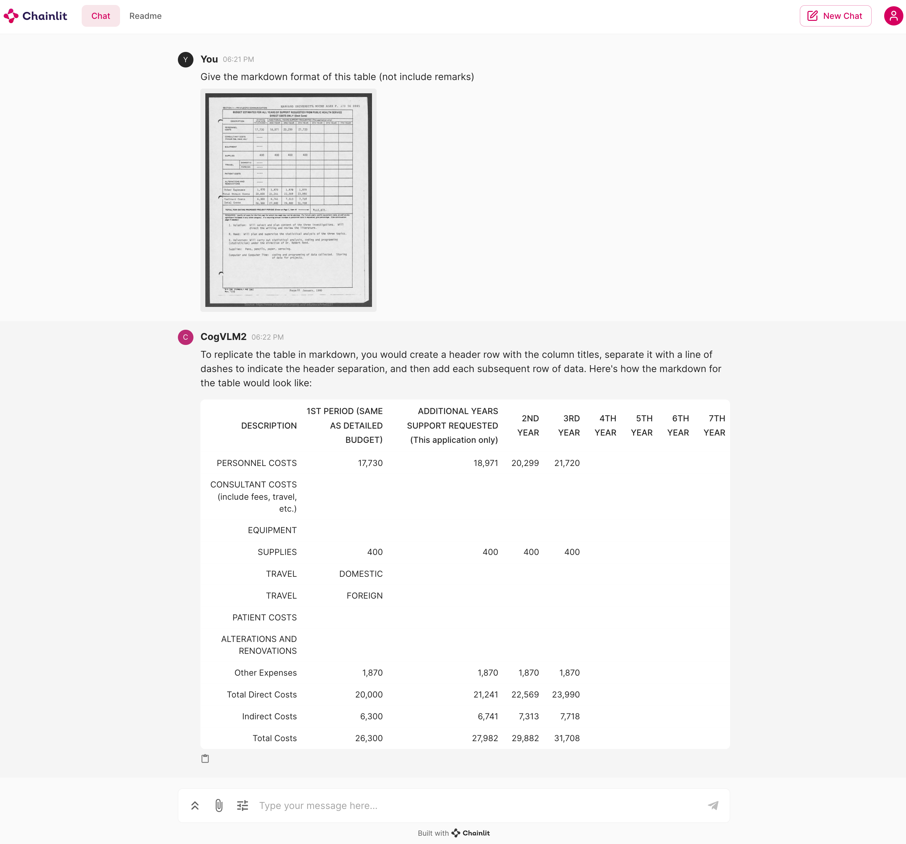

# Basic Demo

[Read this in English.](./README.md)

### 最低配置要求

Python: 3.10.12 以上版本。

操作系统: 建议使用 Linux 操作系统运行以避免`xformers`库安装问题。建议使用 NVIDIA GPU 以防止兼容性问题。

GPU要求如下表格所示

| 模型名称                        | 19B 系列模型                        | 备注           |
|-----------------------------|---------------------------------|--------------|
| BF16 / FP16 推理              | 42GB                            | 测试对话文本长度为2K  | 
| Int4    推理                  | 16GB                            | 测试对话文本长度为2K  |
| BF16 Lora Tuning (带有视觉专家微调) | 73GB (使用8卡A100 80G显卡并使用 Zero 2) | 训练对话文本长度为 2K |

在运行任何代码之前，请确保你已经安装好了所有的依赖包。你可以通过以下命令来安装所有的依赖包：

```shell
pip install -r requirements.txt
```

## CLI 调用模型

运行本代码以开始在命令行中对话。请注意，模型必须在一张GPU上载入

```shell
CUDA_VISIBLE_DEVICES=0 python cli_demo.py
```

如果您有多张GPU，您可以通过以下代码执行多卡拉起模型，并将模型的不同层分布在不同的GPU上。

```shell
python cli_demo_multi_gpu.py
```

在 `cli_demo_multi_gpu.py` 中，我们使用了 `infer_auto_device_map`
函数来自动分配模型的不同层到不同的GPU上。你需要设置 `max_memory` 参数来指定每张GPU的最大内存。例如，如果你有两张GPU，每张GPU的内存为23GiB，你可以这样设置：

```python
device_map = infer_auto_device_map(
    model=model,
    max_memory={i: "23GiB" for i in range(torch.cuda.device_count())},
    # set 23GiB for each GPU, depends on your GPU memory, you can adjust this value
    no_split_module_classes=["CogVLMDecoderLayer"]
)
```

## Web端在线调用模型

运行本代码以开始在 WebUI 中对话。

```shell
chainlit run web_demo.py
```

拉起对话后，你将能和模型进行对话，效果如下：



## OpenAI API

我们提供了一个简单的示例，通过以下代码拉起模型，之后，您可以使用 OpenAI API格式的方式请求和模型的对话。

```shell
python openai_api_demo.py
```

开发者可以通过以下代码来调用模型：

```shell
python openai_api_request.py
```


